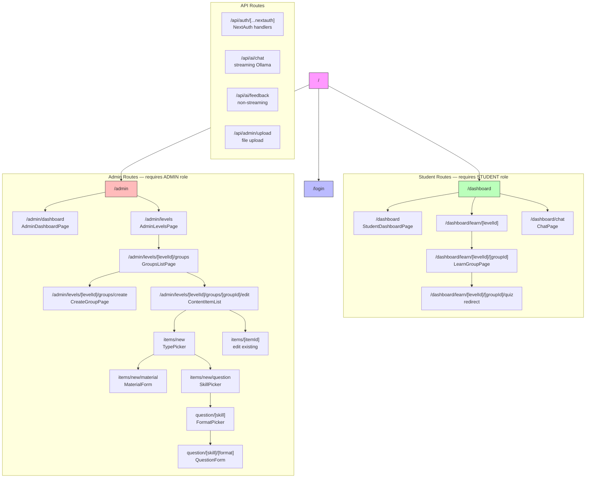
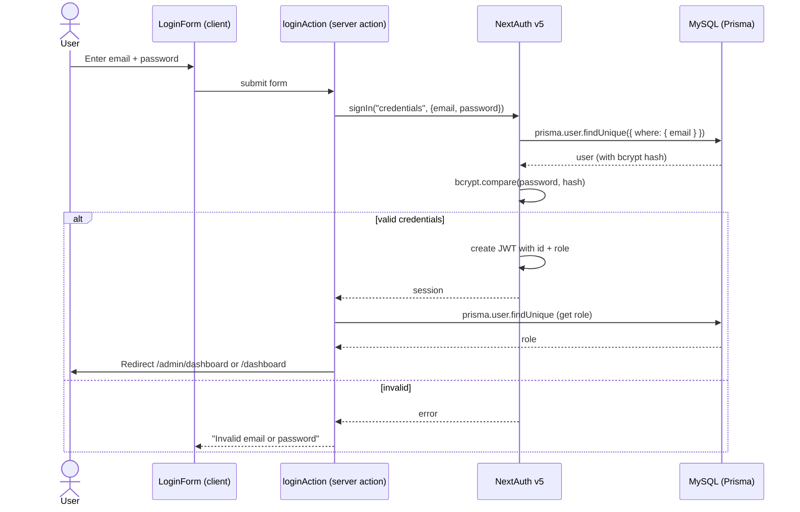
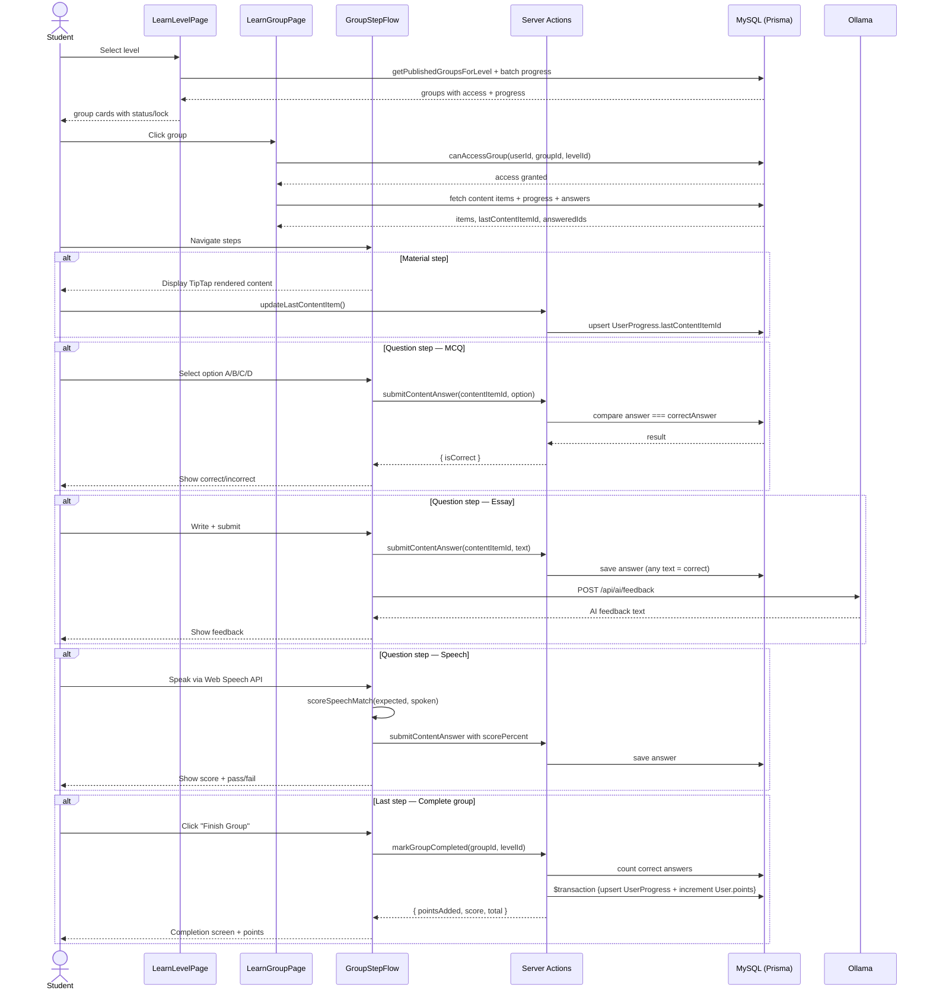
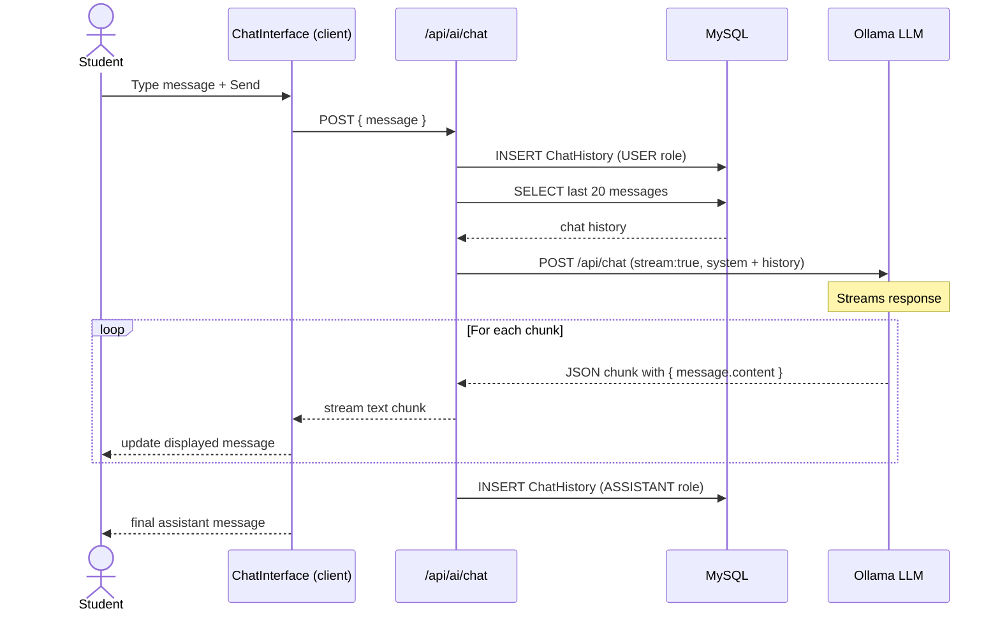
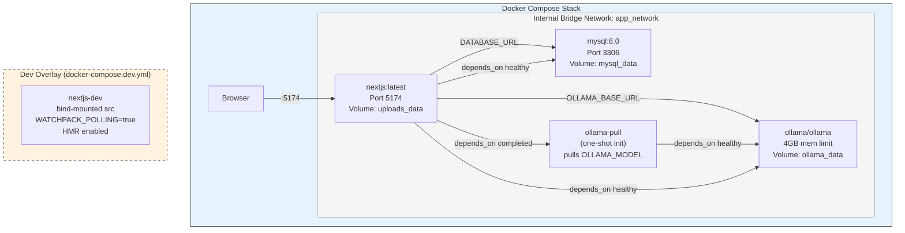
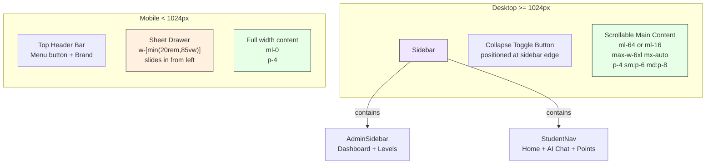

# Next-Gamifikasi — Complete Project Review & Reference

> **Purpose:** This document serves as the definitive reference for any AI (or human) to understand the Next-Gamifikasi project without reading the full codebase. It is the starting point for onboarding, feature development, and maintenance.

---

## 1. Project Overview

**What it is:** A gamified learning platform with AI-powered feedback. Students progress through levels → groups → materials → questions. Admins manage content via a wizard interface. AI (Ollama local LLM) provides chat assistance and essay feedback.

**Tech Stack:**
- **Framework:** Next.js 14.2.35 (App Router), React 18.3.1, TypeScript 5.6
- **Auth:** NextAuth v5 (beta.25) with Credentials provider + bcryptjs + JWT sessions
- **Database:** Prisma 5.22 ORM + MySQL 8.0 (InnoDB)
- **AI:** Ollama (local LLM, e.g. qwen2.5:3b) — streaming chat + non-streaming feedback
- **UI:** Tailwind CSS 3.4 + shadcn/ui (New York style) + Radix Colors (Violet/Slate/Amber) + Radix Primitives (Collapsible, Dialog, Dropdown, Progress, RadioGroup, ScrollArea, Sheet, Tabs)
- **Editor:** TipTap 3.25 (StarterKit, Link, Image, Placeholder extensions)
- **Icons:** lucide-react
- **Font:** Plus Jakarta Sans (single typeface via next/font)
- **Deployment:** Docker (multi-stage standalone build) + Docker Compose (mysql + ollama + nextjs)

**Environment Variables:**
- `DATABASE_URL` — MySQL connection string
- `AUTH_SECRET` / `NEXTAUTH_SECRET` — NextAuth JWT secret
- `NEXTAUTH_URL` — Base URL for auth callbacks
- `OLLAMA_BASE_URL` — Ollama server URL (e.g. `http://ollama:11434`)
- `OLLAMA_MODEL` — Ollama model name (e.g. `qwen2.5:3b`)
- `MYSQL_ROOT_PASSWORD`, `MYSQL_DATABASE`, `MYSQL_USER`, `MYSQL_PASSWORD` — Docker MySQL credentials

---

## 2. Data Model (Prisma Schema)

7 models in `prisma/schema.prisma`, mapped to MySQL via `@@map()`. All tables use InnoDB.

### 2.1 `User` → `users`

| Field | Type | Notes |
|-------|------|-------|
| id | Int (auto) | PK |
| name | String | |
| email | String | `@unique` |
| password | String | bcrypt hash |
| role | Role enum | `ADMIN \| STUDENT` |
| points | Int | default 0, gamification currency |
| createdAt | DateTime | |
| updatedAt | DateTime | |

Relations: `progress[]`, `answers[]`, `chatHistory[]`
Index: `@@index([role])`

### 2.2 `Level` → `levels`

| Field | Type | Notes |
|-------|------|-------|
| id | Int (auto) | PK |
| name | LevelName enum | `BASIC \| INTERMEDIATE \| HARD`, `@unique` |
| description | String? | |
| order | Int | `@unique`, `@map("order_index")` |

Relation: `groups[]`

### 2.3 `LearningGroup` → `learning_groups`

| Field | Type | Notes |
|-------|------|-------|
| id | Int (auto) | PK |
| levelId | Int | FK → Level, CASCADE |
| title | String | |
| order | Int | `@map("order_index")` |
| isPublished | Boolean | default false |
| createdAt | DateTime | |
| updatedAt | DateTime | |

Relations: `level`, `contentItems[]`, `progress[]`
Index: `@@index([levelId, isPublished, order])`

### 2.4 `GroupContentItem` → `group_content_items` (polymorphic table)

This is the unified content table. A single item is either a MATERIAL or a QUESTION, determined by the `type` field. Fields are conditionally used based on `type` and question `format`.

| Field | Type | Used When | Notes |
|-------|------|-----------|-------|
| id | Int (auto) | always | PK |
| groupId | Int | always | FK → LearningGroup, CASCADE |
| type | ContentItemType | always | `MATERIAL \| QUESTION` |
| order | Int | always | `@map("order_index")` |
| title | String? | MATERIAL | |
| content | String? (LongText) | MATERIAL | TipTap JSON |
| questionText | String? (Text) | QUESTION | |
| skill | QuestionSkill? | QUESTION | `SPEAKING \| READING \| LISTENING` |
| format | QuestionFormat? | QUESTION | `MULTIPLE_CHOICE \| ESSAY \| SPEECH_RECOGNITION` |
| options | Json? | MCQ | array of 4 option strings |
| correctAnswer | String? | MCQ | the correct option text |
| expectedSpeech | String? (Text) | Speech Recognition | expected sentence |
| audioUrl | String? | Listening | uploaded audio path |
| explanation | String? (Text) | optional | shown after answering |
| essayRubric | String? (Text) | Essay | grading guidance |

Relations: `group`, `answers[]`
Index: `@@index([groupId, order])`

### 2.5 `UserProgress` → `user_progress`

| Field | Type | Notes |
|-------|------|-------|
| id | Int (auto) | PK |
| userId | Int | FK → User, CASCADE |
| groupId | Int | FK → LearningGroup, CASCADE |
| lastContentItemId | Int? | current step position |
| isGroupCompleted | Boolean | default false |
| startedAt | DateTime | |
| completedAt | DateTime? | |

Unique: `@@unique([userId, groupId])` — one progress record per user per group
Index: `@@index([userId, isGroupCompleted])`

### 2.6 `UserAnswer` → `user_answers`

| Field | Type | Notes |
|-------|------|-------|
| id | Int (auto) | PK |
| userId | Int | FK → User, CASCADE |
| contentItemId | Int | FK → GroupContentItem, CASCADE |
| answer | String (Text) | student's submitted answer |
| isCorrect | Boolean | |
| scorePercent | Int? | used for speech recognition score |
| aiFeedback | String? (Text) | Ollama-generated feedback |
| createdAt | DateTime | |

Note: Supports upsert — if a user re-answers, the existing record is updated rather than creating a duplicate.
Index: `@@index([userId, contentItemId])`

### 2.7 `ChatHistory` → `chat_history`

| Field | Type | Notes |
|-------|------|-------|
| id | Int (auto) | PK |
| userId | Int | FK → User, CASCADE |
| role | ChatRole | `USER \| ASSISTANT` |
| message | String (Text) | |
| createdAt | DateTime | |

Index: `@@index([userId, createdAt])`

### 2.8 Seed Data

File: `prisma/seed.ts`

```
Users:
  - Admin: admin@gamifikasi.com / admin123 (Role: ADMIN)
  - Student: student@gamifikasi.com / student123 (Role: STUDENT)

Levels:
  - BASIC (order: 1, description: "Beginner level")
  - INTERMEDIATE (order: 2, description: "Intermediate level")
  - HARD (order: 3, description: "Advanced level")
```

### 2.9 Migration History

1. `20250606000000_learning_platform` — initial schema
2. `20250606120000_add_performance_indexes` — performance index additions
3. `20250607000000_unified_content_items` — migration to unified `GroupContentItem` (from separate Material/Question tables)

---

## 3. Authentication & Authorization

**Flow:**
1. Login form (`LoginForm`) submits to `loginAction` server action
2. `loginAction` calls `signIn("credentials")` from NextAuth
3. `authorize()` callback in `src/auth.ts`:
   - Validates email/password with Zod
   - Queries user by email via Prisma
   - Compares password with bcrypt
   - Returns `{ id, name, email, role }` on success, `null` on failure
4. JWT callback stores `token.id` and `token.role`
5. Session callback maps to `session.user`
6. On success, redirects: ADMIN → `/admin/dashboard`, STUDENT → `/dashboard`

**Auth Config (`src/auth.config.ts`):**
- `pages.signIn` → `/login`
- `session.strategy` → `"jwt"`
- `authorized` callback (runs on every request via middleware):
  - `/admin/*` → ADMIN role only, else redirect to `/login`
  - `/dashboard/*` → any logged-in user, else redirect to `/login`
  - `/login` → if logged in, redirect to `/admin/dashboard` or `/dashboard`
- JWT + Session callbacks attach `id` and `role`

**Auth Helpers (`src/lib/auth-helpers.ts`):**
- `requireAuth()` — redirects to `/login` if no session
- `requireAdmin()` — redirects to `/dashboard` if not ADMIN
- `requireStudent()` — redirects to `/admin/dashboard` if not STUDENT
- `getUserId(session)` — parses `session.user.id` to integer for Prisma queries

---

## 4. Routing Architecture (App Router)

### 4.1 Root Layout (`src/app/layout.tsx`)
- Font: Plus Jakarta Sans via `next/font/google`
- Providers: `ThemeProvider` (next-themes), `Toaster` (sonner)
- CSS: `globals.css` with Radix Color tokens

### 4.2 Entry Point
| Route | Page | Component |
|-------|------|-----------|
| `/` | `HomePage` | Redirects based on session (login / dashboard / admin/dashboard) |

### 4.3 Guest Routes
| Route | Layout | Page Component |
|-------|--------|---------------|
| `/login` | None (full-page) | `LoginPage` — split layout: hero (left) + card (right) |

### 4.4 Student Routes (layout: AppShell + StudentNav sidebar)
| Route | Page Component | Description |
|-------|----------------|-------------|
| `/dashboard` | `StudentDashboardPage` | 3 level cards with progress bars + Start/Continue CTAs |
| `/dashboard/learn/[levelId]` | `LearnLevelPage` | Group list with access control, status badges, progress bars |
| `/dashboard/learn/[levelId]/[groupId]` | `LearnGroupPage` | Step-by-step flow via `GroupStepFlow` |
| `/dashboard/chat` | `ChatPage` | AI chat interface with history |

### 4.5 Admin Routes (layout: AppShell + AdminSidebar)
| Route | Page Component | Description |
|-------|----------------|-------------|
| `/admin/dashboard` | `AdminDashboardPage` | Stats cards (students/groups/questions) + level links |
| `/admin/levels` | `AdminLevelsPage` | 3 level cards with group counts |
| `/admin/levels/[levelId]/groups` | `GroupsListPage` | Group list with edit/publish/delete actions |
| `/admin/levels/[levelId]/groups/create` | `CreateGroupPage` | Form to create a new group |
| `/admin/levels/[levelId]/groups/[groupId]/edit` | `GroupEditLayout` + `ContentItemList` | Edit group title + manage content items |

### 4.6 Admin Content Item Creation Wizard
| Route | Component | Step |
|-------|-----------|------|
| `.../edit/items/new` | `TypePicker` | Choose Material or Question |
| `.../edit/items/new/material` | `MaterialForm` | TipTap rich text editor |
| `.../edit/items/new/question` | `SkillPicker` | Choose Speaking / Reading / Listening |
| `.../edit/items/new/question/[skill]` | `FormatPicker` | Choose format (depends on skill) |
| `.../edit/items/new/question/[skill]/[format]` | `QuestionForm` | Fill in question details |

### 4.7 API Routes
| Route | Method | Description |
|-------|--------|-------------|
| `/api/auth/[...nextauth]` | GET, POST | NextAuth handlers |
| `/api/ai/chat` | POST | Streaming Ollama chat with history |
| `/api/ai/feedback` | POST | Non-streaming Ollama feedback generation |
| `/api/admin/upload` | POST | File upload (images ≤5MB, audio ≤20MB) |

---

## 5. Business Logic — Learning Flow

### 5.1 Core Progression (`src/lib/progression.ts`)

**Sequential group access:**
- Groups within a level are ordered by `order` ascending
- First group is always accessible
- Each subsequent group is locked until the previous group's `isGroupCompleted` = true
- Access check: `buildGroupAccessMap()` iterates groups and checks previous group's completion status
- `canAccessGroup()`: individual check with single query
- `getLevelGroupsWithProgress()`: batch version that fetches all groups + progress in 2 queries

**Step progress tracking:**
- `computeStepProgress(items, progress)`: calculates `{ completed, total, percent }`
- `completed` = index of `lastContentItemId` + 1 (or `total` if `isGroupCompleted`)
- `getGroupStepProgress()`: single group version
- `getBatchGroupStepProgress()`: batch version for dashboard (avoids N+1)

### 5.2 Group Step Flow (`GroupStepFlow` component)

The student learning experience is a step-by-step flow:

1. Items are displayed one at a time in order
2. **Materials:** Read-only, rendered from TipTap JSON via `tiptapJsonToHtml()`. Student can proceed immediately.
3. **Questions:** Must be answered before the Next button becomes enabled (tracked via `stepAnswered` Set)
4. **Navigation:** Previous/Next buttons; clicking updates `lastContentItemId` via `updateLastContentItem()` server action
5. **Step sidebar:** Shows numbered steps with icons (BookOpen for materials, HelpCircle for questions), checkmarks on answered questions
6. **Completion:** On last step's Next click → `markGroupCompleted()` is called

### 5.3 Points & Group Completion (`markGroupCompleted`)

```typescript
// Points calculation:
const pointsPerQuestion = 10;
const pointsAdded = (score / total) * total * pointsPerQuestion;
// Simplified: score * 10 (max = total * 10)
```

1. Fetches all QUESTION type items for the group
2. Counts how many the student answered correctly
3. Calculates points: `Math.round((score / total) * total * pointsPerQuestion)`
4. Runs a `$transaction`:
   - Upserts `UserProgress` with `isGroupCompleted = true` and `completedAt = now()`
   - Increments `User.points` by `pointsAdded`
5. Revalidates the level and group paths

### 5.4 Question Answering (`submitContentAnswer`)

**MCQ:**
- Compares `answer === item.correctAnswer` (exact string match of the option text)
- `isCorrect` = boolean match result
- No `scorePercent` needed

**Essay:**
- Any non-empty answer is considered correct (`answer.trim().length > 0`)
- Also fetches `/api/ai/feedback` for Ollama-generated feedback
- Feedback is stored in `UserAnswer.aiFeedback`

**Speech Recognition:**
- Uses `scoreSpeechMatch(expectedSpeech, spoken)` for scoring
- `isCorrect = scorePercent >= 90` (SPEECH_PASS_THRESHOLD)
- `scorePercent` passed explicitly to `submitContentAnswer`

**Upsert behavior:**
- Answers are upserted: if the user already answered this question, the record is updated rather than duplicated

---

> **Note on Middleware:** Next.js Auth v5 handles route protection via the `authorized` callback in `auth.config.ts` directly, without a separate `middleware.ts` file. There is no middleware file in this project.

## 6. Ollama AI Integration

### 6.1 Configuration (`src/lib/ollama.ts`)

```typescript
function getOllamaConfig() {
  // Reads OLLAMA_BASE_URL and OLLAMA_MODEL from env
  // Throws if either is not set
}
```

### 6.2 Chat Endpoint (`/api/ai/chat`)

**Request:** `POST { message: string }`
**Response:** Streamed text/plain

**Flow:**
1. Authenticates user (returns 401 if not logged in)
2. Validates message is not empty
3. Saves user message to `ChatHistory`
4. Fetches last 20 chat messages as context
5. Calls Ollama `/api/chat` with `stream: true`:
   - System prompt: "You are a learning assistant that helps students understand course materials. Always respond in English."
   - Messages: system + last 20 history entries
6. Streams response back to client via `ReadableStream` (NDJSON parsing)
7. After stream completes, saves full assistant response to `ChatHistory`

### 6.3 Feedback Endpoint (`/api/ai/feedback`)

**Request:** `POST { contentItemId, userAnswer }`
**Response:** `{ feedback: string, isCorrect: boolean }`

**Flow:**
1. Authenticates user
2. Looks up the question by `contentItemId`
3. Builds prompt via `buildFeedbackPrompt(question, userAnswer, correctAnswer, explanation)`
4. Calls Ollama `/api/generate` (non-streaming)
5. Saves feedback to `UserAnswer.aiFeedback`
6. Returns `{ feedback, isCorrect }`
7. **Graceful fallback:** If Ollama errors, returns `"AI feedback is unavailable right now."` with `isCorrect` and `error` field

### 6.4 Speech Scoring (`src/lib/speech-score.ts`)

```typescript
scoreSpeechMatch(expected: string, spoken: string): { percent, wordMatch, charMatch }
```

Algorithm:
1. **Normalize:** lowercase, strip punctuation, collapse whitespace
2. **Word overlap (60% weight):** Count expected words that appear in spoken text
3. **Character overlap (40% weight):** Count character matches using frequency map
4. **Final score:** `wordMatch * 0.6 + charMatch * 0.4`
5. **Pass threshold:** 90 (`SPEECH_PASS_THRESHOLD` constant)

---

## 7. Admin Content Management

### 7.1 Group Management (`src/actions/admin/groups.ts`)

| Action | Description |
|--------|-------------|
| `createGroup(levelId, formData)` | Creates group with auto-incrementing order, redirects to edit page |
| `updateGroup(groupId, levelId, formData)` | Updates title |
| `deleteGroup(groupId, levelId)` | Deletes group (cascades to content items) |
| `togglePublishGroup(groupId, levelId)` | Toggles `isPublished` status |

### 7.2 Content Items (`src/actions/admin/content-items.ts`)

| Action | Description |
|--------|-------------|
| `createMaterialItem(groupId, levelId, { title, content })` | Creates MATERIAL item, auto-orders, redirects to edit page |
| `updateMaterialItem(itemId, groupId, levelId, { title, content })` | Updates MATERIAL item |
| `createQuestionItem(groupId, levelId, data)` | Creates QUESTION item with all typed fields |
| `updateQuestionItem(itemId, groupId, levelId, data)` | Updates QUESTION item |
| `deleteContentItem(itemId, groupId, levelId)` | Deletes any content item |

### 7.3 Content Item Wizard

The creation flow is a multi-page wizard:
1. **TypePicker** (`item-wizards.tsx`): Two cards — Material (book icon) or Question (help icon)
2. **SkillPicker** (for questions): Three buttons — Speaking (Mic), Reading (BookOpen), Listening (Headphones)
3. **FormatPicker** (conditional on skill):
   - Speaking → Speech Recognition, Essay
   - Reading → Multiple Choice, Essay
   - Listening → Multiple Choice, Essay
4. **QuestionForm**: Renders fields based on skill+format combination

### 7.4 Material Editor (`material-editor.tsx`)

- Uses TipTap with StarterKit + Link + Image + Placeholder extensions
- Toolbar: Bold, Italic, Bullet List, Ordered List, Link, Image
- Image upload: opens file picker → `/api/admin/upload` → inserts `setImage()` in editor
- Content stored as TipTap JSON string
- Preview: rendered via `tiptapJsonToHtml()` → `dangerouslySetInnerHTML`

### 7.5 File Upload (`/api/admin/upload`)

- **Auth:** ADMIN only
- **Accepted types:**
  - Images: JPEG, PNG, GIF, WebP (≤5MB)
  - Audio: MP3, WAV, OGG, WebM (≤20MB)
- **Storage:** `public/uploads/{groupId}/{timestamp}-{random}.{ext}`
- **Response:** `{ url: "/uploads/{groupId}/{filename}" }`

### 7.6 TipTap Rendering Architecture

**Important distinction:**
- **Admin editor (client-side):** Uses `@tiptap/react` — a full rich text editor with toolbar. Content is stored as TipTap JSON in the `content` field.
- **Student viewer (server-side):** Uses `tiptapJsonToHtml()` from `src/lib/content-item.ts` — a pure TypeScript function that converts TipTap JSON to HTML strings. This is rendered via `dangerouslySetInnerHTML`. It supports: paragraphs, headings, bullet/ordered lists, links, images, blockquotes, code blocks, bold, italic, and hard breaks. It does NOT support interactive content beyond HTML.
- This means materials are static rendered HTML on the student side — no JavaScript editor runtime needed for viewing.

---

## 8. UI Architecture & Conventions

### 8.1 Layout Shell (`AppShell`)

**Structure:**
- Fixed sidebar (`fixed inset-y-0 left-0`) — hidden on mobile
- Scrollable main content (`ml-64` or `ml-16` on desktop, `ml-0` on mobile)
- Mobile: Sheet drawer for navigation + top header bar with brand name

**Sidebar states:**
- Desktop expanded: `w-64`
- Desktop collapsed: `w-16` (icons only)
- State persisted in `localStorage` via `SidebarContext`

**Mobile:**
- Navigation in Sheet drawer (triggered by hamburger menu button)
- Preview panels in Sheet (triggered by toggle button)
- Step navigation in Sheet (triggered by "Steps" button)

### 8.2 Sidebars

**AdminSidebar:**
- Brand: Sparkles icon + "Gamifikasi" / "Admin Panel"
- Nav: Dashboard (LayoutDashboard), Levels (Layers)
- Footer: Theme toggle + Logout button

**StudentNav:**
- Brand: Sparkles icon + "Gamifikasi" / "Learning Hub"
- User info card: name + points trophy (Amber color)
- Nav: Home (Home), AI Chat (MessageCircle)
- Footer: Theme toggle + Logout button

### 8.3 Design Tokens

Defined in `src/app/globals.css` using Radix Color scales:

| Token | Light | Dark | Usage |
|-------|-------|------|-------|
| `--background` | slate-1 | slate-1 | Page background |
| `--foreground` | slate-12 | slate-12 | Text |
| `--card` | slate-2 | slate-2 | Card background |
| `--primary` | violet-9 | violet-9 | Buttons, links |
| `--primary-foreground` | white | white | Button text |
| `--secondary` | slate-3 | slate-3 | Secondary buttons |
| `--accent` | violet-3 | violet-4 | Hover, selected states |
| `--muted` | slate-3 | slate-3 | Subtle backgrounds |
| `--border` | slate-6 | slate-6 | Borders |
| `--input` | slate-7 | slate-7 | Input borders |
| `--ring` | violet-8 | violet-8 | Focus rings |
| `--destructive` | red-9 | red-9 | Delete/error buttons |
| `--points` | amber-9 | amber-9 | Gamification accents |
| `--sidebar` | slate-2 | slate-2 | Sidebar background |
| `--radius` | 0.5rem | 0.5rem | Border radius |

### 8.4 Component Patterns

**Standard card pattern:**
```tsx
<div className="rounded-lg border border-border bg-card shadow-sm">
```

**Page header pattern:**
- `PageHeader` component: title + optional description + optional children (actions slot)

**Badge variants by status:**
- `notStarted` → `variant="outline"`
- `inProgress` → `variant="secondary"`
- `completed` → `variant="default"`

**Button groups on mobile:**
```tsx
<div className="flex flex-col-reverse gap-2 sm:flex-row sm:justify-between">
```

**Touch targets:**
- Primary controls ≥ 44px: `min-h-11`, `size-11`, or `py-3`

### 8.5 Shared UI Components (`src/components/ui/`)

Shadcn/ui New York style components:
- `alert`, `badge`, `button`, `card`, `collapsible`, `dialog`, `dropdown-menu`
- `input`, `label`, `page-header`, `progress`, `radio-group`, `scroll-area`
- `separator`, `sheet`, `skeleton`, `sonner` (toast), `stat-card`, `tabs`, `textarea`

### 8.6 Labels System (`src/lib/labels.ts`)

- **EVERY** user-facing string is defined here — no hardcoded text in components
- Organized by section: `auth`, `nav`, `theme`, `levels`, `status`, `common`, `admin`, `student`, `login`, `meta`, `api`
- All English — enforced by rule `english-only.mdc`
- Helper functions: `getLevelLabel(name)`, `getStatusLabel(status)`

### 8.7 Mobile Responsiveness

| Pattern | Mobile (<768px) | Desktop (≥768px) |
|---------|----------------|-------------------|
| App sidebar | Sheet drawer | Fixed sidebar |
| Step navigation | Sheet / toggle | Fixed aside column |
| Editor preview | Sheet (closed default) | Side panel with toggle |
| Grids | 1 column | 2-3 columns (`sm:`, `md:`) |
| Page headers | Stacked | `sm:flex-row` |
| Button groups | `flex-col-reverse` | `sm:flex-row` |
| Page padding | `p-4` | `sm:p-6 md:p-8` |

---

## 9. Key Libraries & Versions

```json
{
  "next": "14.2.35",
  "react": "^18.3.1",
  "next-auth": "^5.0.0-beta.25",
  "@prisma/client": "^5.22.0",
  "prisma": "^5.22.0",
  "@tiptap/react": "^3.25.0",
  "@tiptap/starter-kit": "^3.25.0",
  "tailwindcss": "^3.4.17",
  "@radix-ui/colors": "^3.0.0",
  "lucide-react": "^0.469.0",
  "next-themes": "^0.4.6",
  "bcryptjs": "^2.4.3",
  "zod": "^3.24.1",
  "sonner": "^1.7.4",
  "class-variance-authority": "^0.7.1",
  "tsx": "^4.19.2"
}
```

---

## 10. Docker & Deployment

### 10.1 Production (`docker-compose.yml`)

| Service | Image | Description |
|---------|-------|-------------|
| `mysql` | mysql:8.0 | Database with named volume + healthcheck |
| `ollama` | ollama/ollama | Local LLM, 4GB memory limit, named volume |
| `ollama-pull` | ollama/ollama | One-shot init — downloads model, then exits |
| `nextjs` | build from Dockerfile | Production app, port 5174 |

**Dependencies:**
- `nextjs` → `mysql` (healthy) + `ollama` (healthy) + `ollama-pull` (completed)
- Internal bridge network (`app_network`) for service-to-service communication — all services reference each other by container name (e.g. `http://ollama:11434`, `mysql:3306`)

### 10.2 Development (`docker-compose.dev.yml`)

- Disables production `nextjs` service via `profiles: ["production-only"]`
- Adds `nextjs-dev`: bind-mounted `.` directory + `WATCHPACK_POLLING=true` for HMR
- Runs migrations at startup: `npx prisma migrate deploy && npm run dev`

**Usage:**
```bash
docker compose -f docker-compose.yml -f docker-compose.dev.yml up --build
```

### 10.3 Multi-stage Dockerfile (Production)

1. **Stage 1 (deps):** `node:20-alpine`, `npm ci` + prisma schema copy
2. **Stage 2 (builder):** `prisma generate` + `npm run build` → `.next/standalone`
3. **Stage 3 (runner):** Minimal `node:20-alpine`, non-root `nextjs` user (UID 1001)
   - Copies standalone build + prisma/ for runtime migrations
   - Entrypoint: `npx prisma migrate deploy && node server.js`
   - Exposes port 5174

### 10.4 Development Dockerfile (`Dockerfile.dev`)

- Single stage: `npm ci` + `prisma generate`
- Source code bind-mounted at runtime
- Runs `next dev -H 0.0.0.0 -p 5174`

---

## 11. Project Structure

```
next-gamifikasi/
├── prisma/
│   ├── schema.prisma           # Data model (7 models)
│   ├── seed.ts                 # Seed: 2 users + 3 levels
│   └── migrations/             # Prisma migrations
├── src/
│   ├── app/
│   │   ├── layout.tsx          # Root layout (font + providers)
│   │   ├── globals.css         # Radix Color tokens
│   │   ├── page.tsx            # Root redirect
│   │   ├── login/              # Login page
│   │   ├── dashboard/          # Student routes
│   │   │   ├── page.tsx        # Dashboard home
│   │   │   ├── layout.tsx      # StudentNav + AppShell
│   │   │   ├── learn/          # Learning flow
│   │   │   └── chat/           # AI chat
│   │   ├── admin/              # Admin routes
│   │   │   ├── layout.tsx      # AdminSidebar + AppShell
│   │   │   ├── dashboard/      # Stats
│   │   │   ├── levels/         # Level + group management
│   │   └── api/
│   │       ├── auth/           # NextAuth handlers
│   │       ├── ai/             # Ollama chat + feedback
│   │       └── admin/          # File upload
│   ├── actions/
│   │   ├── auth.ts             # Login/logout server actions
│   │   ├── admin/              # Groups, content items, stats
│   │   └── student/            # Quiz, progress
│   ├── components/
│   │   ├── ui/                 # shadcn/ui components
│   │   ├── layout/             # AppShell, sidebars, nav
│   │   ├── admin/              # Group list, content builder
│   │   ├── student/            # Step flow, chat, question steps
│   │   └── providers/          # ThemeProvider
│   └── lib/
│       ├── auth-helpers.ts     # requireAuth/requireAdmin/requireStudent
│       ├── auth.ts             # NextAuth config + handlers
│       ├── auth.config.ts      # Auth middleware rules
│       ├── content-item.ts     # Shared types + TipTap rendering
│       ├── content-routes.ts   # Path builders + slug mapping
│       ├── group-content.ts    # Content item fetch helpers
│       ├── labels.ts           # ALL user-facing strings
│       ├── material-label.ts   # Label formatting
│       ├── ollama.ts           # Ollama API calls
│       ├── ollama-model.ts     # Model name matching
│       ├── prisma.ts           # Singleton Prisma client
│       ├── progression.ts      # Access control + progress computation
│       ├── speech-score.ts     # Speech matching algorithm
│       └── utils.ts            # cn() helper (clsx + tailwind-merge)
├── docker-compose.yml          # Production stack
├── docker-compose.dev.yml      # Dev overlay (HMR)
├── Dockerfile                  # Multi-stage production build
├── Dockerfile.dev              # Dev build
├── tailwind.config.ts          # Tailwind + CSS variable mapping
├── next.config.js              # Standalone output + Prisma tracing
├── components.json             # shadcn/ui config
└── AGENTS.md                   # Agent configuration summary
```

---

## 12. Cursor Rules & Skills Summary

### Rules (always active):
| Rule | Description |
|------|-------------|
| `mysql-indexing-required.mdc` | Every table must have indexes for all access patterns |
| `mysql-query-performance.mdc` | No N+1, use `select` to exclude large text, batch queries |
| `ui-ux-clarity.mdc` | Every screen answers: Where am I? What can I do? What happens next? |
| `mobile-responsive.mdc` | All screens work at 375px, 768px, 1280px |
| `english-only.mdc` | UI + AI responses in English only — via `labels.ts` |

### Project Skills:
| Skill | When to Use |
|-------|-------------|
| `next-gamifikasi-mysql` | Schema migrations, Prisma queries, slow DB issues |
| `next-gamifikasi-ui-ux` | Pages, components, navigation, forms, clarity |

### Global Skills Available:
- **Database:** `prisma-client-api`, `mysql-best-practices`, `prisma-expert`
- **Next.js:** `next-best-practices`, `vercel-react-best-practices`, `vercel-composition-patterns`
- **UI/UX:** `web-design-guidelines`, `accessibility`, `ux-audit`, `frontend-design`, `ui-ux-pro-max`

---

## 13. Performance Rules

### Database Indexes (all present in schema):
1. `User`: `@@index([role])` — student count queries
2. `LearningGroup`: `@@index([levelId, isPublished, order])` — published group listing
3. `GroupContentItem`: `@@index([groupId, order])` — content item ordering
4. `UserProgress`: `@@unique([userId, groupId])` + `@@index([userId, isGroupCompleted])` — progress lookups
5. `UserAnswer`: `@@index([userId, contentItemId])` — answer submission
6. `ChatHistory`: `@@index([userId, createdAt])` — chat history pagination

### Query Rules:
1. **Never run queries inside loops** — batch with `findMany` + `in`
2. **Use `select`** to exclude `LongText`/`Text` fields in list queries
3. **Prefer one query with `include`** over N `findUnique` calls
4. **Use pagination** (`take`/`skip`) for unbounded lists

---

## 14. Critical Anti-patterns to Avoid

| Bad Practice | Good Practice |
|-------------|---------------|
| Icon-only back button | `← Back to Level` with label |
| Multiple primary buttons per card | One primary + outline secondary |
| Hardcoded strings in components | `labels.student.*` / `labels.admin.*` |
| Custom mesh/gradient/glass CSS | Radix Color tokens only |
| Queries in loops | Batch with `findMany` + `in` |
| Inline styles for colors | CSS variables from `globals.css` |
| Multiple fonts | Plus Jakarta Sans only |
| Non-English UI/AI text | English only via `labels.ts` |
| Top nav that scrolls away | Fixed sidebar (`AppShell` pattern) |
| Placeholder as only label | Visible `<Label>` + placeholder |

---

## 15. Architecture Diagrams

### 15.1 App Router — Route Hierarchy



### 15.2 Data Flow — Authentication



### 15.3 Data Flow — Student Learning Progression



### 15.4 Data Flow — AI Chat



### 15.5 Component Hierarchy

```mermaid
graph TD
    subgraph RootLayout
        ThemeProvider --> Toaster
        ThemeProvider --> AppShell
    end

    subgraph AppShell
        direction TB
        SidebarContext --> MobileNavSheet
        SidebarContext --> DesktopSidebar
        SidebarContext --> MainContent

        subgraph DesktopSidebar["Desktop Sidebar (fixed)"]
            direction TB
            AdminSidebar --> NavLink
            AdminSidebar --> ModeToggle
            AdminSidebar --> LogoutButton
            StudentNav --> NavLink
            StudentNav --> PointsCard
            StudentNav --> ModeToggle
            StudentNav --> LogoutButton
        end

        subgraph MainContent["Main Content (scrollable)"]
            direction TB
            PageHeader
            ContentArea
        end
    end

    subgraph StudentPages
        StudentDashboardPage --> StatCard
        StudentDashboardPage --> PageHeader
        StudentDashboardPage --> Progress
        LearnLevelPage --> Badge
        LearnLevelPage --> Progress
        LearnLevelPage --> LockIcon

        LearnGroupPage --> GroupStepFlow

        subgraph GroupStepFlow
            direction TB
            StepsNavList
            QuestionStep
            MaterialDisplay[tiptapJsonToHtml render]
            NavigationButtons["Prev / Next Buttons<br/>Next disabled until answered"]
            CompletionScreen["Completion Screen<br/>points added + back to level"]

            subgraph QuestionStep
                direction TB
                McqStep --> Button
                EssayStep --> Textarea
                EssayStep --> AiFeedback
                SpeakingStep --> MicButton
                SpeakingStep --> ScoreDisplay
                ListeningStep --> AudioPlayer
                ListeningStep --> McqStep
            end
        end

        ChatPage --> ChatInterface
        ChatInterface --> ScrollArea
        ChatInterface --> Input
        ChatInterface --> SendButton
    end

    subgraph AdminPages
        AdminDashboardPage --> StatCard
        AdminDashboardPage --> LevelCard
        GroupsListPage --> GroupList
        GroupList --> GroupListCard
        GroupListCard --> Collapsible
        GroupListCard --> Badge

        GroupEditPage --> GroupEditHeader
        GroupEditPage --> ContentItemList
        ContentItemList --> ContentItemCard
        ContentItemCard --> Collapsible
        ContentItemCard --> MaterialPreview
        ContentItemCard --> QuestionPreview

        NewItemPage --> TypePicker
        NewMaterialPage --> MaterialForm
        MaterialForm --> MaterialEditor
        MaterialForm --> MaterialPreview
        MaterialForm --> EditorPreviewLayout
        MaterialEditor --> EditorToolbar
        MaterialEditor --> EditorContent

        NewQuestionPage --> SkillPicker
        NewQuestionFormatPage --> FormatPicker
        NewQuestionFormPage --> QuestionForm
        QuestionForm --> FileUploadField
        QuestionForm --> OptionsInputs
    end

    subgraph SharedComponents["Shared UI Components (shadcn)"]
        Button
        Input
        Textarea
        Card
        Badge
        Progress
        Sheet
        Collapsible
        ScrollArea
        Alert
        Dialog
        DropdownMenu
        Tabs
        Separator
        Label
        Skeleton
        PageHeader
        StatCard
    end

    style RootLayout fill:#e6f3ff,stroke:#333
    style AppShell fill:#fff0e0,stroke:#333
    style StudentPages fill:#e0ffe0,stroke:#333
    style AdminPages fill:#ffe0e0,stroke:#333
    style SharedComponents fill:#f0e0ff,stroke:#333
```



### 15.6 Database Entity Relationship Diagram

```mermaid
erDiagram
    User ||--o{ UserProgress : has
    User ||--o{ UserAnswer : submits
    User ||--o{ ChatHistory : sends

    Level ||--o{ LearningGroup : contains

    LearningGroup ||--o{ GroupContentItem : contains
    LearningGroup ||--o{ UserProgress : tracks

    GroupContentItem ||--o{ UserAnswer : has

    User {
        int id PK
        string name
        string email UK
        string password
        enum role
        int points
        datetime created_at
        datetime updated_at
    }

    Level {
        int id PK
        enum name UK
        string description
        int order_index UK
    }

    LearningGroup {
        int id PK
        int level_id FK
        string title
        int order_index
        bool is_published
        datetime created_at
        datetime updated_at
    }

    GroupContentItem {
        int id PK
        int group_id FK
        enum type "MATERIAL | QUESTION"
        int order_index
        string title "if MATERIAL"
        text content "if MATERIAL - TipTap JSON"
        string question_text "if QUESTION"
        enum skill "if QUESTION"
        enum format "if QUESTION"
        json options "if MCQ"
        string correct_answer "if MCQ"
        text expected_speech "if SPEECH"
        string audio_url "if LISTENING"
        text explanation
        text essay_rubric "if ESSAY"
        datetime created_at
        datetime updated_at
        @@index [group_id, order_index]
    }

    UserProgress {
        int id PK
        int user_id FK
        int group_id FK
        int last_content_item_id
        bool is_group_completed
        datetime started_at
        datetime completed_at
        @@unique [user_id, group_id]
        @@index [user_id, is_group_completed]
    }

    UserAnswer {
        int id PK
        int user_id FK
        int content_item_id FK
        text answer
        bool is_correct
        int score_percent
        text ai_feedback
        datetime created_at
    }

    ChatHistory {
        int id PK
        int user_id FK
        enum role "USER | ASSISTANT"
        text message
        datetime created_at
        @@index [user_id, created_at]
    }
```

### 15.7 Docker Service Architecture



### 15.8 Layout Structure — AppShell


