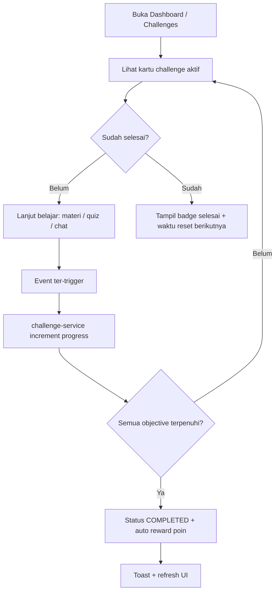
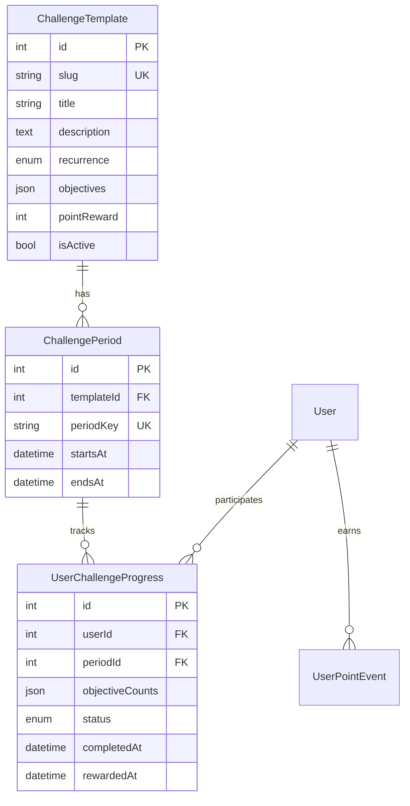

# Challenge / Mission System — Design Spec

## Ringkasan

Sistem Challenge/Mission memberi siswa target waktu-terbatas (harian/mingguan) yang terintegrasi dengan aktivitas belajar yang sudah ada. Progress dihitung otomatis dari event yang sama dengan sistem poin (material, jawaban benar, chat, grup selesai).

Contoh bawaan:

| Slug | Tipe | Target | Reward |
|------|------|--------|--------|
| `daily-challenge` | Harian | 2 materi + 3 jawaban benar | 15 pts |
| `weekly-english-mission` | Mingguan | 1 grup + 10 jawaban benar + 5 chat | 50 pts |
| `speaking-challenge` | Mingguan | 5 jawaban speaking benar | 30 pts |

---

## Alur Siswa



### Detail alur per event

1. **Material selesai** → `completeMaterial()` → jika poin baru diberikan → hitung objective `COMPLETE_MATERIALS`
2. **Jawaban benar (pertama)** → `submitContentAnswer()` → hitung `CORRECT_ANSWERS` dan/atau `SPEAKING_CORRECT` (skill/format speaking)
3. **Pesan chat** → API chat → hitung `CHAT_MESSAGES`
4. **Grup selesai** → `markGroupCompleted()` → hitung `COMPLETE_GROUPS`

Progress hanya dihitung jika event terjadi di dalam window `startsAt`–`endsAt` periode aktif.

---

## Model Database



### Enums

- **ChallengeRecurrence**: `DAILY`, `WEEKLY`
- **ChallengeObjectiveType**: `COMPLETE_MATERIALS`, `CORRECT_ANSWERS`, `SPEAKING_CORRECT`, `CHAT_MESSAGES`, `COMPLETE_GROUPS`
- **UserChallengeStatus**: `IN_PROGRESS`, `COMPLETED`, `REWARDED`
- **PointEventType** (+): `CHALLENGE_REWARD`

### Format `objectives` (JSON)

```json
[
  { "type": "COMPLETE_MATERIALS", "target": 2, "label": "Selesaikan 2 materi" },
  { "type": "CORRECT_ANSWERS", "target": 3, "label": "Jawab benar 3 soal" }
]
```

### Format `objectiveCounts` (JSON)

```json
{ "0": 1, "1": 2 }
```

Key = index objective; value = progress saat ini.

### Period key

- Harian: `YYYY-MM-DD` (UTC)
- Mingguan: `YYYY-Www` (ISO week, UTC)

---

## Integrasi Poin

Saat semua objective terpenuhi:

1. Update `UserChallengeProgress.status` → `COMPLETED`
2. `awardPoints()` dengan `CHALLENGE_REWARD` dan key `challenge:{periodId}` (idempotent)
3. Status → `REWARDED`, set `rewardedAt`

---

## UI

- `/dashboard/challenges` — daftar challenge aktif + progress bar per objective
- Preview card di dashboard home
- Link di student sidebar

---

## Batasan MVP

- Template di-seed; admin CRUD belum termasuk (dapat ditambah later)
- Timezone UTC (konsisten dengan discussion milestone)
- Satu reward per user per periode (unique constraint)
